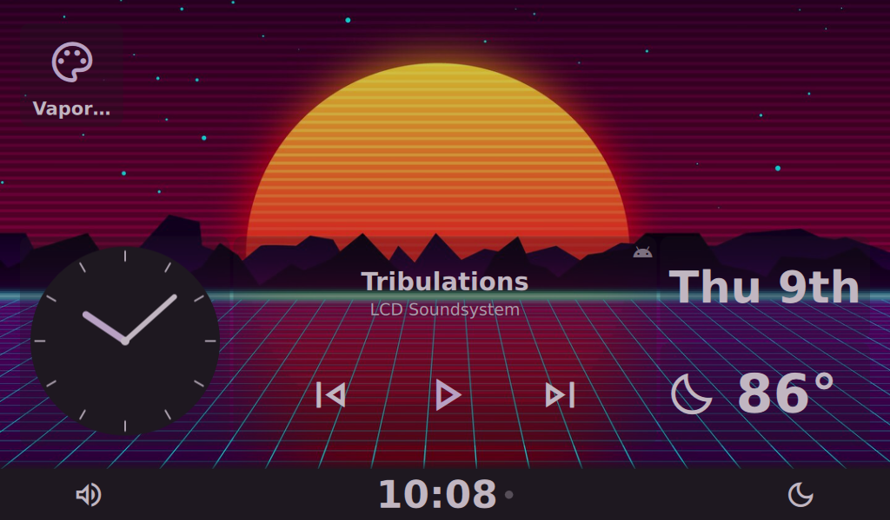
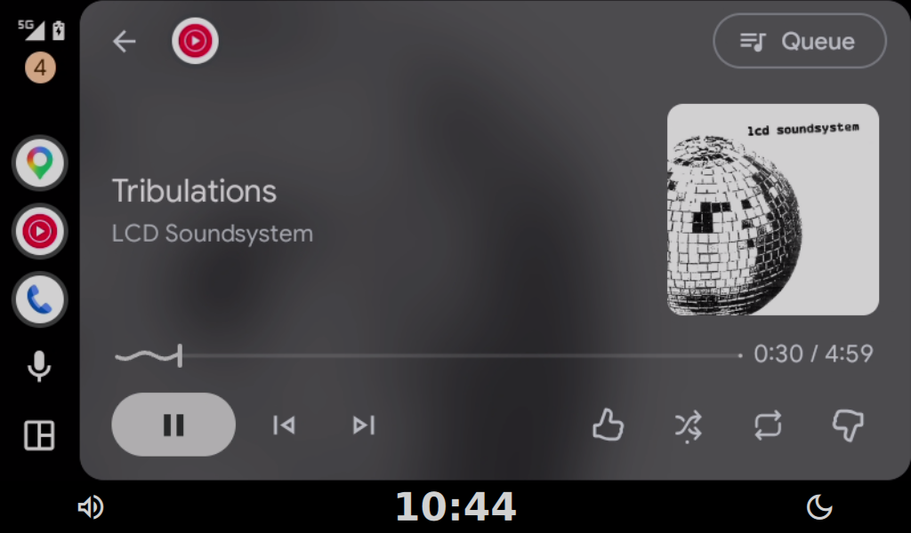

# OpenAuto Prodigy

[](https://www.gnu.org/licenses/gpl-3.0)

Open-source **wireless Android Auto head unit** for the Raspberry Pi — a clean-room successor to the discontinued OpenAuto Pro. Qt 6 + QML shell, plugin architecture, and a web config panel, built for in-car touchscreens.




## Features

- **Wireless Android Auto, end-to-end** — Bluetooth discovery, WiFi AP handoff, session negotiation, video, audio, multi-touch, reconnect handling. No USB cable.
- **Plugin architecture** — built-in plugins for AA projection, Bluetooth audio (A2DP/AVRCP), phone calls (HFP), local media player, and equalizer; dynamic plugins load from `~/.openauto/plugins/`.
- **Multi-dashboards + widgets** — configurable dashboard grid with native widgets and HTML/JS web widgets.
- **Web config panel** — configure the head unit from any browser on the network.
- **External API v1** — protobuf over TCP/WebSocket with pairing, for companion apps and integrations.
- **Theming** — day/night themes, uploadable theme packages.

## Hardware

- Raspberry Pi 4 running Raspberry Pi OS (Trixie)
- HDMI touchscreen (USB multi-touch; 1024x600 and similar wide formats work well)
- The Pi's built-in WiFi acts as the access point the phone joins; built-in Bluetooth handles discovery, BT audio, and HFP

## Quickstart

### Prebuilt (Pi)

```bash
git clone https://github.com/mrmees/openauto-prodigy.git
cd openauto-prodigy
bash install.sh            # interactive: choose prebuilt download or source build
bash install.sh --list-prebuilt   # just list available prebuilt releases
```

The installer runs platform checks (OS, architecture, Pi model), installs dependencies, writes config, and enables the systemd service. Release/packaging internals: [docs/reference/release-packaging.md](docs/reference/release-packaging.md).

### From source

```bash
git clone --recurse-submodules https://github.com/mrmees/openauto-prodigy.git
cd openauto-prodigy
mkdir -p build && cd build
cmake ..
cmake --build . -j"$(nproc)"
ctest --output-on-failure
```

Full platform setup and dependency list: [docs/development.md](docs/development.md).

## Repository layout

```text
src/            C++ app: core services, plugin system, AA runtime, UI models
qml/            QML shell and app views (packaged into the binary)
libs/           prodigy-oaa-protocol — AA protocol library (proto defs via submodule)
proto/api/      External API v1 contract (frozen, additive-only)
web-config/     Flask web config panel
tests/          CTest suite
docs/           Documentation (see docs/INDEX.md)
```

## Documentation

- [docs/INDEX.md](docs/INDEX.md) — full documentation map
- [docs/architecture.md](docs/architecture.md) — components, boundaries, data flow
- [docs/development.md](docs/development.md) — build environments, cross-compiling, Pi deploy
- [CONTRIBUTING.md](CONTRIBUTING.md) — how to file issues and submit changes

## License

GNU General Public License v3.0 — see `LICENSE`.
